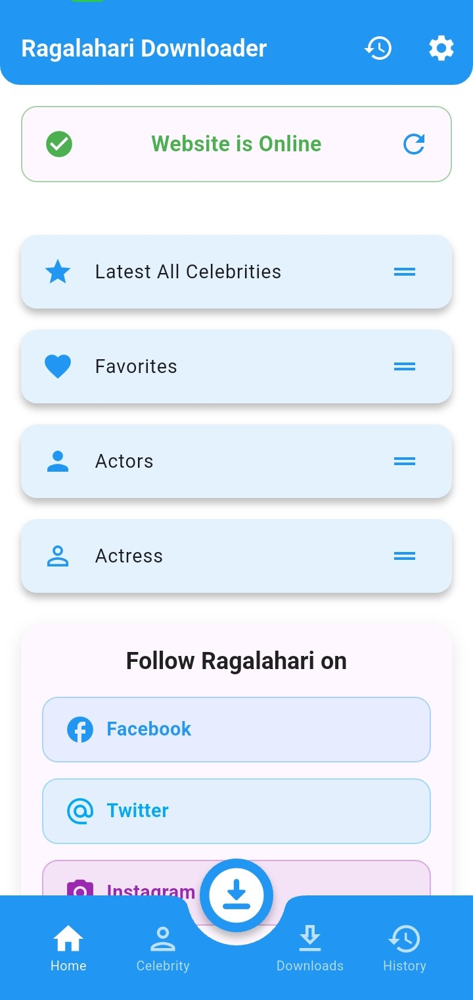
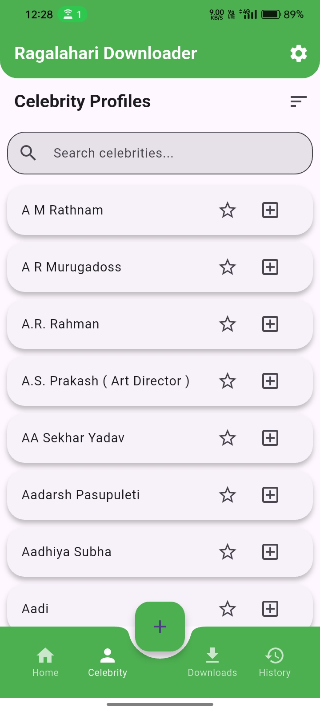
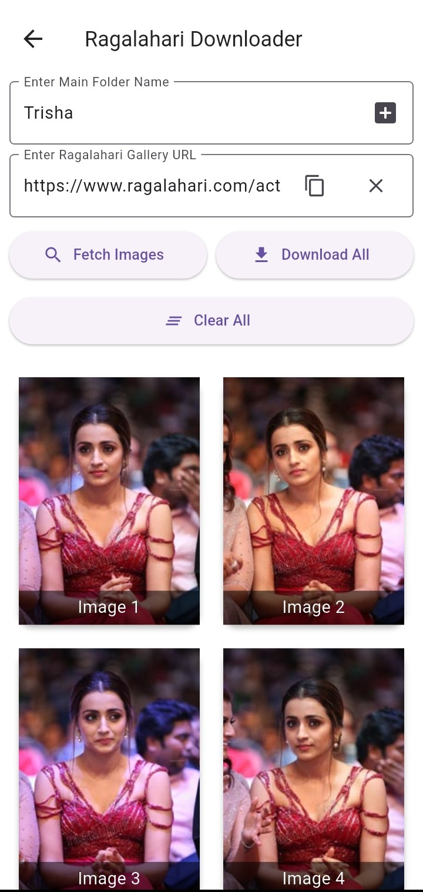
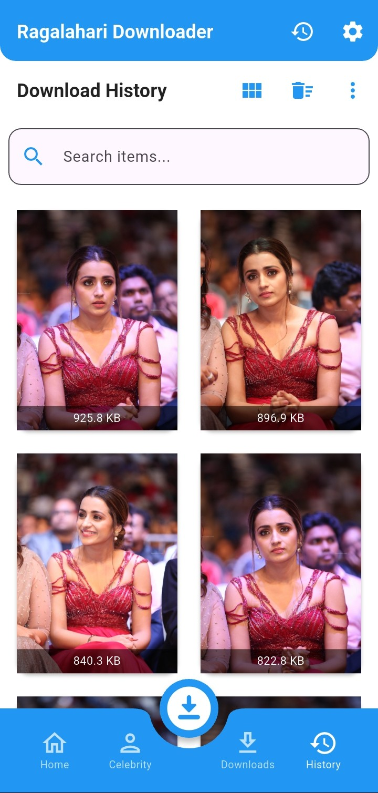
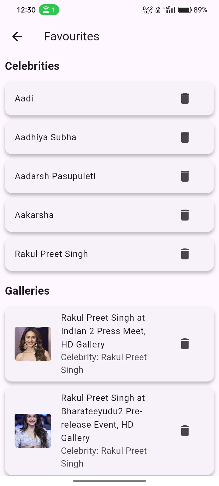
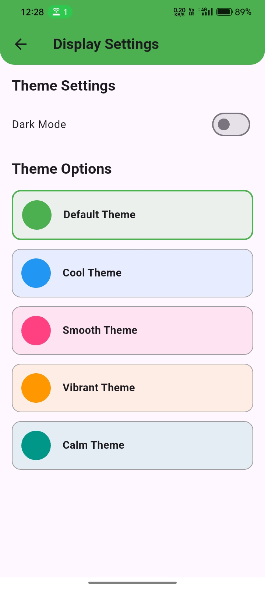

<div align="center">


# 📸 Ragalahari Image Gallery Downloader

### Flutter App to Download Celeb Albums from Ragalahari.com

[](https://github.com/DevSon1024/ragalahari_downloader_2025/releases/latest)
[](https://github.com/DevSon1024/ragalahari_downloader_2025/releases)
[](LICENSE)

</div>

---

## 📱 Screenshots

<div align="center">






</div>

---

## ✨ Overview

**Ragalahari Gallery Downloader** is a Flutter-based Android app that lets you explore and download image galleries of your favorite celebrities from [Ragalahari.com](https://www.ragalahari.com).

This app supports gallery previews, celebrity management via CSV, bulk downloads, and download history — all built with a **mobile-first approach** and sleek UI.

---

## 🌟 Features

- 🔥 **Latest Celebrity Albums** with preview
- 👩‍🎤 **Celebrity Explorer** – Browse by actress/model
- 📥 **Gallery Downloader** – Paste a gallery URL and download all images
- ✅ Select individual images before downloading (optional)
- 📊 **Download Manager** – Pause, resume, cancel downloads
- 🕘 **History Viewer** – Sort, delete, and share past downloads
- ❤️ **Favorites Tab** – Save your favorite celebrities and albums
- 🎨 **Themes & Display Settings** – Light/Dark mode with color customization
- 💾 **Storage Settings** – Set your download folder
- 📎 **CSV-based Celebrity Management**
- 🔃 **Database Updater** – Easily update celebrity list

---

## 🧪 How It Works

1. Paste a gallery URL from Ragalahari into the downloader.
2. The app fetches all image previews.
3. Select individual or all images and hit download.
4. Manage, view, or share downloads from the History tab.

---

## 🛠 Tech Stack

- **Flutter & Dart**
- **Dio, Http, HTML Parsing**
- **Provider for State Management**
- **Permission Handler & Path Provider**
- **CSV & File Picker**
- **Mobile-First Responsive UI**

---

## 📁 Folder Structure

```text
/lib
│
├── main.dart
├── settings_sidebar.dart
├── pages/
│   ├── celebrity_list_page.dart
│   ├── download_mangager_page.dart
│   ├── history_page.dart
│   ├── latest_celebrity.dart
│   ├── ragalahari_downloader.dart
├── screens/
│   ├── ragalahari_downloader_screen.dart
├── widgets/
│   ├── navbar.dart
│   ├── theme_config.dart
├── settings/
│   ├── display_settings_page.dart
│   ├── storage_settings.dart
│   ├── favourite_page.dart
│   ├── privacy_policy_page.dart
│   └── update_database_page.dart
```

---

## ⬇️ Download

- [GitHub Releases](https://github.com/DevSon1024/ragalahari_downloader_2025/releases)
- F-Droid / Play Store (Coming soon)

---

## 💬 Feedback & Contributions

Found a bug or have a feature request?  
Open an [issue](https://github.com/DevSon1024/ragalahari_downloader_2025/issues) on GitHub.

---

## 📄 License

This project is licensed under the [MIT License](LICENSE).

---

<div align="right">

[↑ Back to Top](#📸-ragalahari-image-gallery-downloader)

</div>