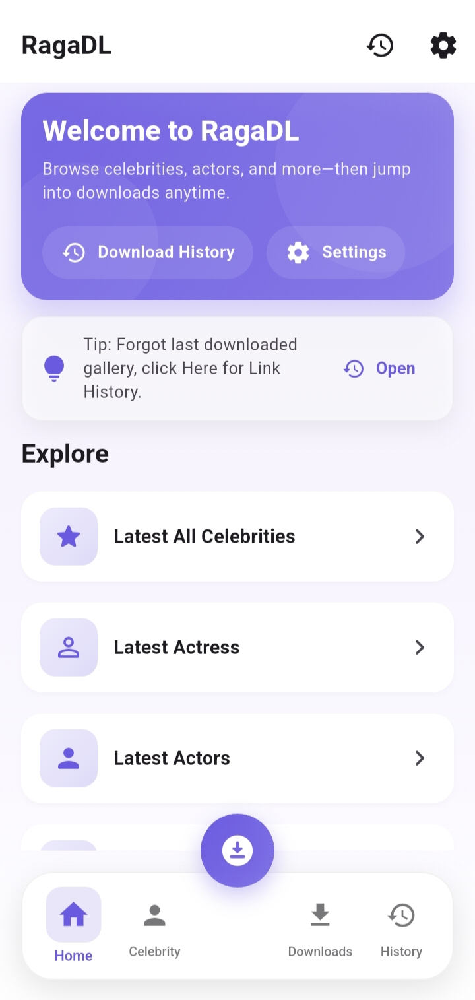
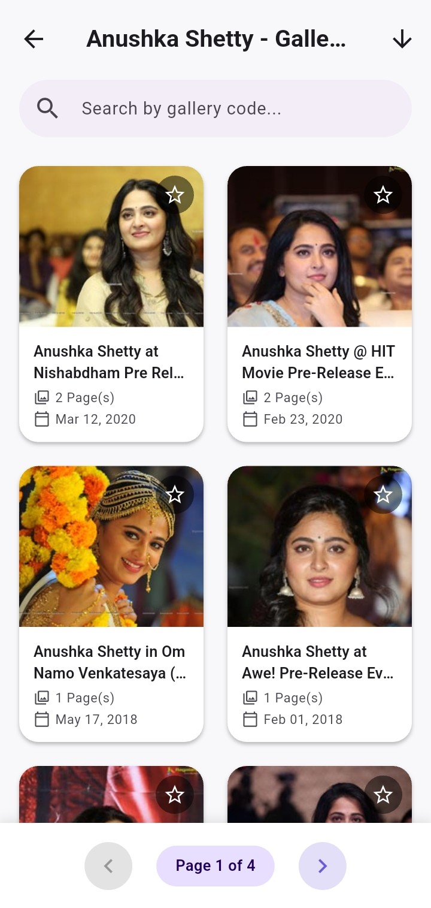
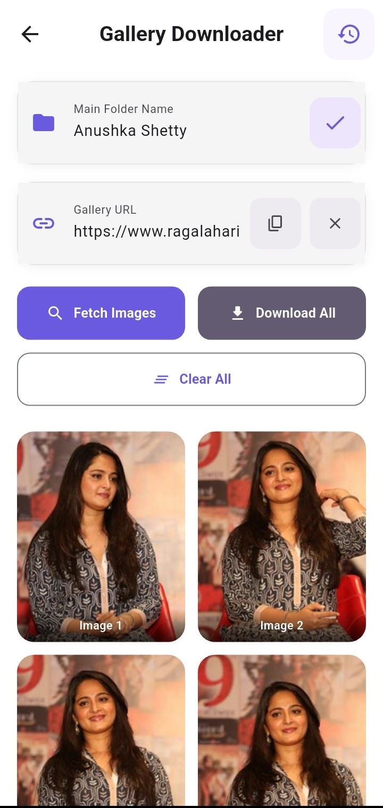
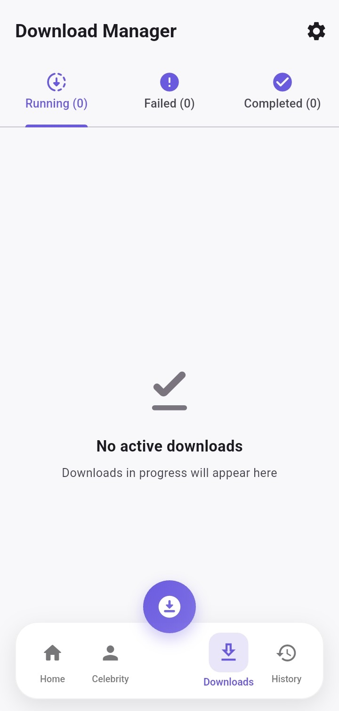
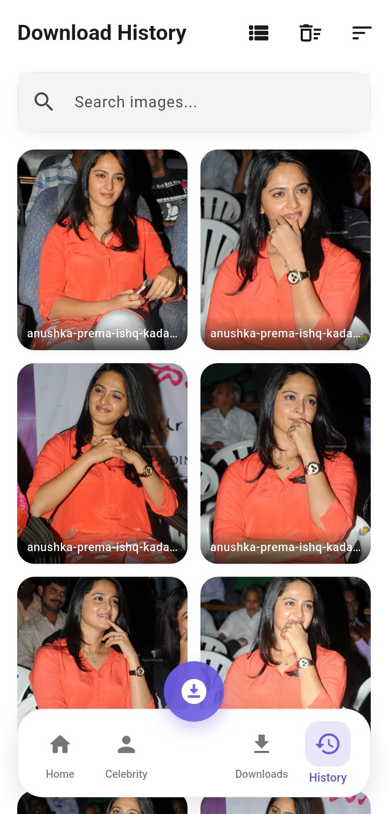

<div align="center">


# RagaDL: Gallery Downloader

### A Flutter application for scraping and downloading high-fidelity celebrity image galleries.

[](https://github.com/DevSon1024/ragadl-app/releases/latest)
[](https://github.com/DevSon1024/ragadl-app/releases)
[](LICENSE)

</div>

---

> ## Screenshots

<div align="center">






</div>

---

> ## Supported Portals

RagaDL utilizes a decoupled, strategy-based scraping engine. The parser automatically cleans markup patterns and resolves high-resolution source images from:

- **Ragalahari (`ragalahari.com`, `m.ragalahari.com`)** - Resolves full actress portfolios and media events. Downloads the entire set of high-res image listings directly.
- **Idlebrain (`idlebrain.com`)** - Tollywood gallery archives. Filters out promotional/navigation layouts and strips thumbnail suffixes to retrieve original clean source files.
- **Behindwoods (`behindwoods.com`)** - Extensive cinema and actress galleries. Because single galleries can hold thousands of images, it includes a batch range selector (`Start Image` to `End Image`) to crawl and download images in custom sizes safely.

---

> ## Key Features

- **Smart Downloader** - Paste a link from any of the supported portals. The scraper automatically detects the source, extracts individual image previews, and presents them in an interactive grid.
- **Controlled Batch Downloading** - Downloader queues downloads via background worker threads using a connection-pooled HTTP client. Supports pausing, resuming, and cancelling active downloads.
- **Range-Bound Fetching** - Enter custom ranges for Behindwoods links. Enables downloading large galleries in smaller batches to save data and prevent network timeouts.
- **Favorites & History** - Save your favorite galleries and celebrities. Features an offline search, download history, recycle bin, and single-click share options.
- **Material 3 Customization** - Sleek dark and light themes with dynamic primary color generation. Select an accent color from display settings, and the entire app adapts its color scheme on the fly.
- **Offline Data Logs** - View downloaded lists sorted by folder structure, search history, and manage space settings directly.

---

> ## Architecture & Technical Highlights

- **State Management & Lifecycle** - Built on **Riverpod** for reactive, compile-safe state caching. Implements `autoDispose` controllers to clean up memory, isolate instances, and tear down streams when the user leaves a tab.
- **Concurrency Controls** - Scrapers run on background **Dart Isolates** to offload HTML parsing and DOM manipulation from the main UI thread. Network crawling is restricted to a batch concurrency of `5` to prevent server rate-limiting and connection exhaustion.
- **Connection Caching** - Reusable, connection-pooled client using a singleton **Dio** client with custom exponential-backoff retries.
- **Render Optimizations** - Uses `RepaintBoundary` wrappers on high-frequency scrolling widgets and lazy-loads zoom/gesture controllers in full-screen viewers to prevent frame drops.

---

> ## How to Run Locally

1.  Make sure you have [Flutter SDK](https://docs.flutter.dev/get-started/install) installed.
2.  Clone the repository:
    ```bash
    git clone https://github.com/DevSon1024/ragadl-app.git
    cd ragadl-app
    ```
3.  Install dependencies:
    ```bash
    flutter pub get
    ```
4.  Run the application on an emulator or connected device:
    ```bash
    flutter run
    ```

---

## 💬 Feedback & Contributions

If you find a bug, encounter a scraping error on a specific gallery, or want to suggest adding support for a new portal, please feel free to open a [GitHub Issue](https://github.com/DevSon1024/ragadl-app/issues).

---

## 📄 License

This project is licensed under the [MIT License](LICENSE).
